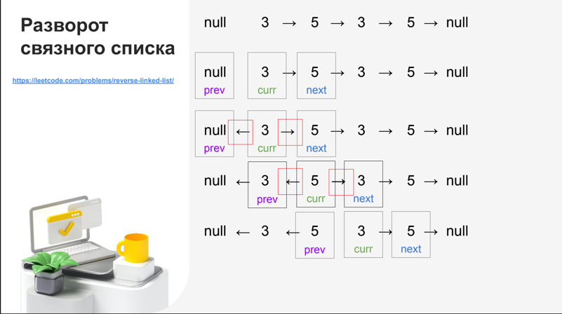

Способы решения задач на LinkedList. 


1. Создать 3 поинтере и перемещать их по списку. 

Если надо развернуть массив, то можно воспользоваться такой конструкцией


```java
public ListNode reverseList(ListNode head) {

    ListNode prev = null;
    ListNode cur = head;

    while (cur != null) {
        ListNode next = cur.next;
        cur.next = prev;
        prev = cur;
        cur = next;
    }

    return prev;

}
```
2. Если надо найти цикл в списке, необходимо завести два указателя, второй указатель - быстрый
будет увеличиваться на 2 при каждом проходе и в конце концов догонит медленный, тогда будет понятно есть цикл или нет.

Чтобы вернуть ноду, в которой начинается цикл, необходимо начать новый цикл и увеличивать голову(head) и slow на 1
 пока head не станет равным slow

```
 while (head != slow) {
    head = head.next;
    slow = slow.next;
}
```
